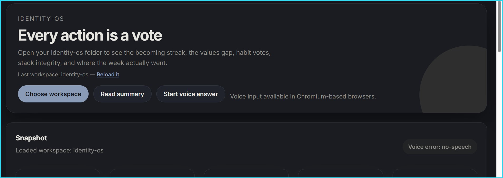
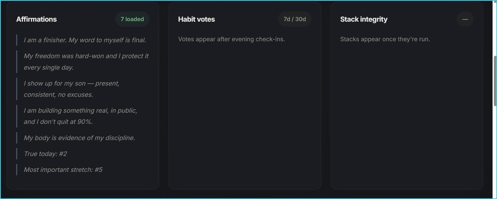
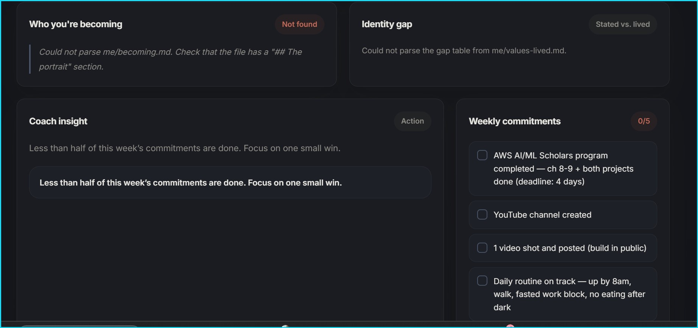

# identity-os

A local-first, folder-based AI coaching system for identity transformation. You define who you're becoming; the system holds you to it — daily check-ins, identity-based habit tracking, stated-vs-lived values gap analysis, and a coach that's allowed to walk away when you're not being real.

No database. No app. No subscription. Markdown files, [Claude Code](https://claude.com/claude-code), and two small Node scripts.

## How it works

- **Every action is a vote** for who you're becoming or who you said you were done being. Evening check-ins score the day and cast votes per habit.
- **The coach is generated, not hardcoded.** A 5-question persona builder during intake sets its confrontation level, register, and style — from hard-confrontation systems engineer to warm Socratic mentor.
- **The gap is the job.** Your stated values sit next to your lived values (derived from actual behavior, with evidence). The coach exists to close that gap.
- **The coach can refuse.** Deflect twice, minimize a slip, or perform growth instead of doing the work, and the session ends. The refusal persists into the next session until you address it.
- **Habit stacks are tracked as chains.** When your morning routine keeps breaking at the same link, the tracker names the break point and the coach runs a friction audit on it.

## Setup

Requirements: [Node.js](https://nodejs.org) 18+, [Claude Code](https://claude.com/claude-code).

```
git clone <this repo> identity-os
cd identity-os
node scripts/setup.mjs
claude
```

That's it. Your first session is automatically routed to intake — a Socratic conversation (no forms, no homework) that populates your identity files, goals, habits, and affirmations, and generates your coach's persona. Plan for two or three sittings.

## Daily use

| You say | You get |
|---------|---------|
| "morning check-in" | 5–10 min: affirmations, top 3 tasks, trigger check, commit |
| "evening check-in" | 10–15 min: score the day, hard question, values check, votes, journal |
| "weekly review" | 20–30 min: commitments pass/fail, patterns, values audit, 90-day check |
| "goal setting" | Define done, pre-load the obstacle, wire it into the system |
| "deep work" | Project breakdown or day block planning |

Everything else is a freeform coaching session.

The tracker (`logs/tracker.md`), vote ledger, and weekly summaries regenerate automatically after every session — you never update them by hand.

## Dashboards

Open `tools/coach.html` in a Chromium browser and point it at your identity-os folder: streaks, the values gap, habit vote sparklines, stack integrity, commitments. `tools/dashboard.html` is a kanban board over `TASKS.md`.





## Content mode (optional)

Building in public? Say yes during intake and the coach quietly flags shareable moments into `content/flags.md`, captures ideas at check-ins, and runs dedicated content sessions that mine your week for material. Say no and the system never mentions it.

## Privacy

Everything personal — `me/`, `logs/`, `journal/`, content data, `TASKS.md` — is gitignored. The repo you fork and the repo you live in stay cleanly separated. Nothing leaves your machine.

## Architecture

See [docs/specs/2026-06-10-identity-os-v1-design.md](docs/specs/2026-06-10-identity-os-v1-design.md) for the full design and [docs/decisions/DECISIONS.md](docs/decisions/DECISIONS.md) for the decision log.

```
CLAUDE.md        → router: identity, brief contract, session routing, rules, permissions
coach/           → who your coach is (generated during intake)
me/              → who you are (gitignored, populated via intake)
goals/ habits/   → what you're committed to
skills/ hooks/   → coaching moves and session flows
rules/ reference/→ constraints and behavioral science
scripts/         → zero-dependency Node automation (brief + tracker)
logs/ journal/   → session memory (gitignored, append-only)
```

## License

[CC BY 4.0](LICENSE) — fork it, remix it, build on it. Attribution appreciated.
